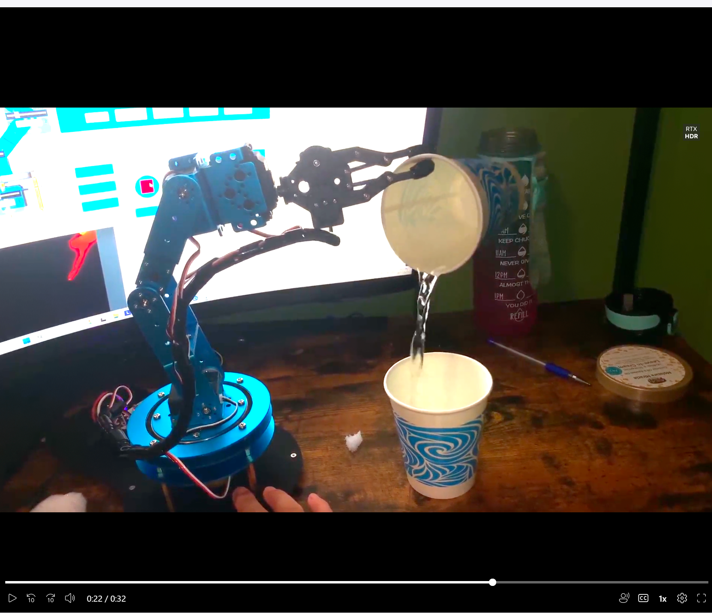

# LE-Arm Robotic Arm Control (Arduino)

This project started with controlling the LE-Arm robotic arm using its default company app, which felt too restrictive in terms of movement and flexibility.

To improve control, I connected the robotic arm to an Arduino and implemented custom movement logic, allowing more dynamic and programmable behavior.

---

## What I worked on

- multi-joint servo control using Arduino  
- movement sequencing for pick-and-place tasks  
- adjusting speed and timing to make movements smoother  
- debugging hardware issues like unstable motion and incorrect angles  

---

## Improvements over the default app

- smoother multi-step movement sequences  
- coordinated multi-joint control instead of step-by-step actions  
- adjustable speed and timing  
- continuous motion patterns instead of fixed presets  

---

## Pick and Pour Sequence (Demo Logic)

I implemented a basic sequence where the robotic arm:

- moves to a source cup  
- grips the cup using the gripper  
- lifts and moves it to a second location  
- tilts the wrist to simulate pouring  
- returns to its original position  

This sequence uses gradual servo transitions to reduce jerky movement and improve stability.

---

## Challenges

- maintaining consistent movement due to timing differences  
- tuning servo angles for accurate positioning  
- handling unstable or jerky motion  
- managing grip strength without slipping or crushing objects  

---

## Demo

Short demo showing robotic arm control, movement sequencing, and tilt-based pouring behavior.

[Watch demo here](https://sofiauniversity-my.sharepoint.com/:v:/g/personal/santosh_bogati_sofia_edu/IQCmalUl8AzDQaL0s3DU5xB8AdFR2FUZURbhL_xJovdM6eY)

---

## Setup

Physical setup of the LE-Arm robotic system connected to Arduino for custom control.

---

## Notes

This is a simplified implementation focused on control and sequencing.  
Achieving stable real-world pouring depends on precise calibration of servo angles, grip strength, and load handling.

---

## Tech Used

- Arduino  
- Servo motors  
- Basic C/C++ (Arduino)  
